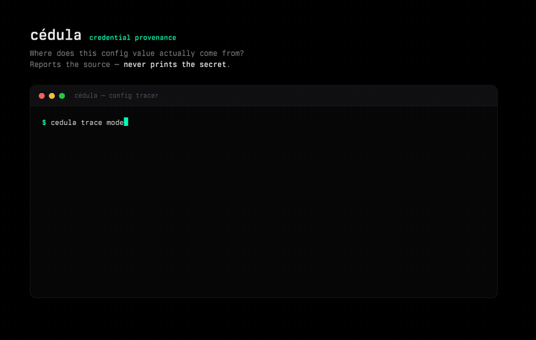

# cédula

**Where does this config value actually come from?** A read-only provenance
tracer for credentials and config — it reports the *source* (env var, macOS
Keychain, 1Password, an auth store, an inline literal) and **never prints the
resolved secret.**

```sh
npx @sainzs/cedula trace config.json providers.azure.apiKey
npx @sainzs/cedula scan  config.json
```



## Why this exists

Config files accumulate indirection: an `apiKey` that's secretly a shell
command, a `security find-generic-password` call, a `!`-prefixed substitution.
When a request fails with `401`, the first question is *which store is this
value even coming from?* — and you can't `cat` the file to find out, because
the value is a command that resolves to a secret.

`cédula` answers the provenance question structurally: it parses the config,
classifies each externalized value by source, and reports the chain without
ever executing the command or printing what it returns. The secret stays in
its store.

Born from auditing the AI-harness configs in
[augment-ai-provider](https://github.com/sainzs/augment-ai-provider) — a
`models.json` where the Azure key resolves from macOS Keychain and the Bedrock
key from the pi auth store, and the whole point was keeping both out of
plaintext.

## What it does

- **`trace <file> <key.path>`** — provenance of one value: source kind, the
  (non-secret) store identifier, and the command *shape* (e.g. the Keychain
  service name, not the password).
- **`scan <file>`** — every command-substituted value in a config, grouped by
  source.

Recognized sources: inline literal, macOS Keychain (`security`), pi auth store
(`pi auth print-api-key`), 1Password (`op read`), AWS CLI/SSO, and generic
shell substitution.

## Guarantees

- **Read-only.** No command in the config is ever executed.
- **Secret-safe.** Resolved values are never printed — only the source.
- **Zero dependencies.** Plain Node, no runtime required beyond it.

## License

MIT
